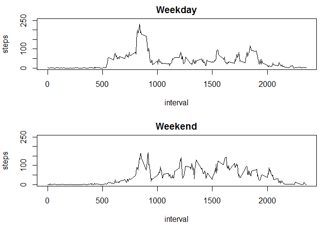

# Reproducible Research: Peer Assessment 1
Daniel Nolan  


## Loading and preprocessing the data

The following code is used to download and unzip the file, then store the dataset in a data frame called `activity`.


```r
# download the data using the url provided, and store the dataset in the variable 'activity'
url <- "https://d396qusza40orc.cloudfront.net/repdata%2Fdata%2Factivity.zip"
temp <- tempfile()
download.file(url=url,temp)
activity <- read.csv(unz(temp, "activity.csv"))
unlink(temp)

# ensure date column is of class Date
activity$date <- as.Date(activity$date)
```

Observe the structure of the `activity` data frame:


```r
str(activity)
```

```
## 'data.frame':	17568 obs. of  3 variables:
##  $ steps   : int  NA NA NA NA NA NA NA NA NA NA ...
##  $ date    : Date, format: "2012-10-01" "2012-10-01" ...
##  $ interval: int  0 5 10 15 20 25 30 35 40 45 ...
```

## What is mean total number of steps taken per day?

The `dplyr` package will be used throughout the analysis.


```r
# load the dplyr package
library(dplyr)
```

First, use the `dplyr` functions to summarize by date:


```r
# summarize data by day
steps.byDay <- filter(activity, !is.na(steps)) %>% group_by(date) %>% summarize(steps = sum(steps))
```

Next, create a histogram of steps per day:


```r
# create histogram of steps by day
hist(steps.byDay$steps,
     main="Histogram of Steps per Day (NAs removed)",
     xlab="Steps per Day")
```


In summary, the mean number of steps per day, removing NAs, is given by:


```r
avgSteps <- mean(steps.byDay$steps)
avgSteps
```

```
## [1] 10766.19
```

And the median, again removing NAs, is given by:


```r
medSteps <- median(steps.byDay$steps)
medSteps
```

```
## [1] 10765
```

## What is the average daily activity pattern?

The average daily activity pattern can be visualized by first summarizing by 5-minute interval, then plotting a time series as below.


```r
# summarize by 5-minute interval
steps.byInterval <- filter(activity, !is.na(steps)) %>% group_by(interval) %>% summarize(steps = mean(steps))

# create time series plot
plot(steps.byInterval$steps,
     type = "l",
     xaxt = 'n',
     xlab = "5-Minute Interval",
     ylab = "Avg. Steps",
     main = "Average Daily Activity Pattern")
n <- dim(steps.byInterval)[1]
hour.markers <- seq(1, n, by = 12)
axis(1, at = hour.markers, labels = steps.byInterval$interval[hour.markers])
```


The 5-minute interval associated with the maximum average number of steps can be found as follows:


```r
M <- max(steps.byInterval$steps) # this is the maximum average number of steps
select(filter(steps.byInterval, steps == M), interval) # this is the interval corresponding to the max
```

```
## Source: local data frame [1 x 1]
## 
##   interval
##      (int)
## 1      835
```

## Imputing missing values

Our approach will be to replace NAs with the mean for the given 5-minute interval. This can be carried out using the `left_join()` function of the `dplyr` package.


```r
# use left_join() to "look up" imputed values
impute <- filter(activity, is.na(steps)) %>% left_join(steps.byInterval, by = "interval") %>% select(steps = steps.y, date, interval) 

# store complete dataset in new data frame
imputed = filter(activity, !is.na(steps)) %>% rbind(impute) 
```

Next we update the histogram with the addition of the imputed values:


```r
# summarize data by day, with imputed values
imputed.byDay <- group_by(imputed, date) %>% summarize(steps = sum(steps))

# create histogram of activity by day, with imputed values
hist(imputed.byDay$steps,
     main="Histogram of Steps per Day (NAs replaced)",
     xlab="Steps per Day")
```


The new mean and median, as well as their differnces vs. the original values (with NAs removed, not replaced), are:


```r
avgSteps.imputed <- mean(imputed.byDay$steps)
medSteps.imputed <- median(imputed.byDay$steps)
avgSteps.delta   <- avgSteps.imputed - avgSteps
medSteps.delta   <- medSteps.imputed - medSteps
```

```r
avgSteps.imputed
```

```
## [1] 10766.19
```

```r
avgSteps.delta
```

```
## [1] 0
```

```r
medSteps.imputed
```

```
## [1] 10766.19
```

```r
medSteps.delta
```

```
## [1] 1.188679
```

As the reader can see, the effect on the mean is zero, which makes sense because because we replaced NAs with the means for their respective 5-minute intervals. The effect on the median is minor, which also makes sense because the distribution is not particularly skewed.

## Are there differences in activity patterns between weekdays and weekends?

To examine the differnce in daily activity pattern for weekdays vs. weekends, we first classify every row as being a 'Weekday' or a 'Weekend'.


```r
weekdays.list <- c("Monday","Tuesday","Wednesday","Thursday","Friday")
imputed <- mutate(imputed, day.type = ifelse(weekdays(date) %in% weekdays.list, "Weekday", "Weekend"))
```

Now we are in a position to set up a panel plot with two time series, one for Weekdays and the other for Weekends.


```r
par(mfrow = c(2,1), mar = c(5,4,2,1))
with(
  subset(imputed, day.type == "Weekday") %>% group_by(interval) %>% summarize(steps = mean(steps)),
  plot(interval,
       steps, type = "l",
       ylim = c(0,250),
       main = "Weekday"))
with(
  subset(imputed, day.type == "Weekend") %>% group_by(interval) %>% summarize(steps = mean(steps)),
  plot(interval,
       steps,
       type = "l",
       ylim = c(0,250),
       main = "Weekend"))
```



The weekday activity pattern is sedentary throughout the middle of the day with a large spike around 8:30am, presumably a morning commute or workout. The weekend pattern is stedily higher throughout the day -- and appears to continue later into the night -- but without such a significant spike in the morning.
